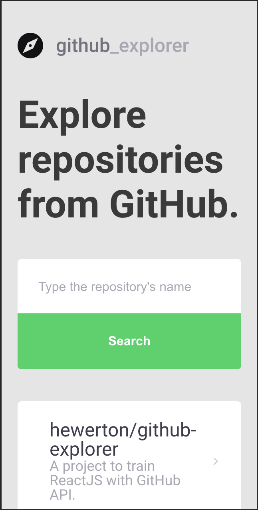
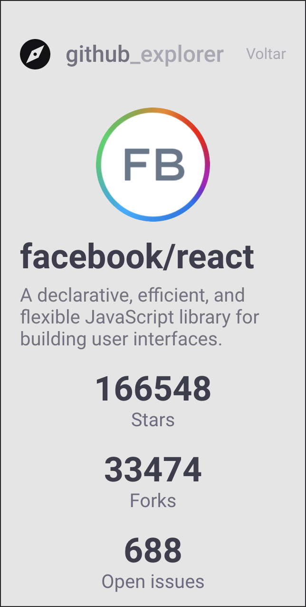
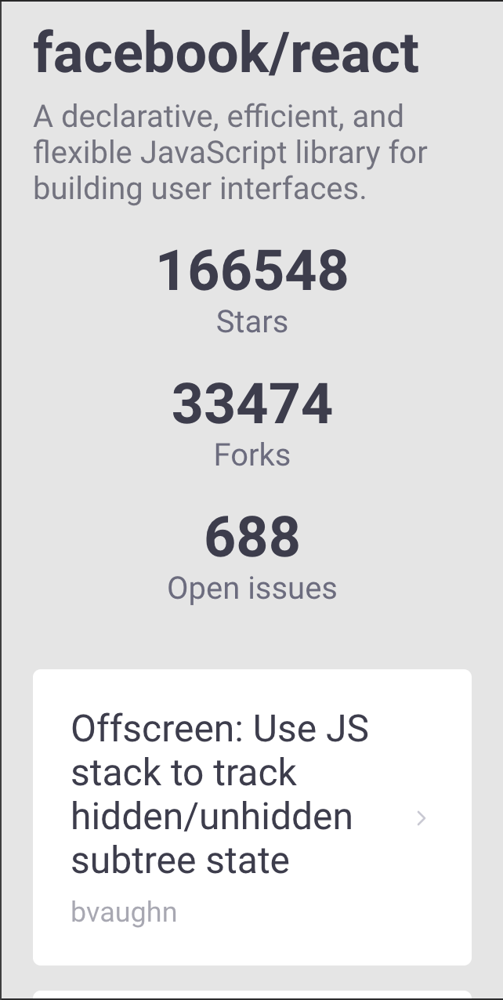
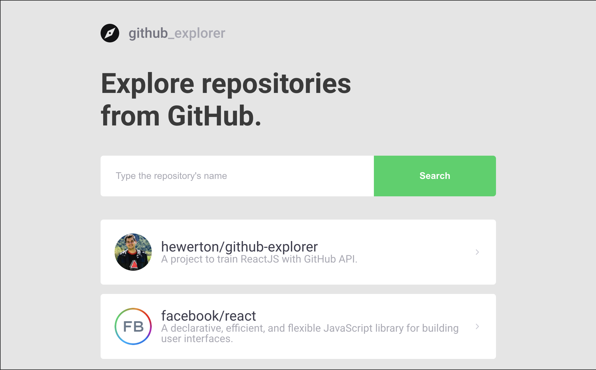
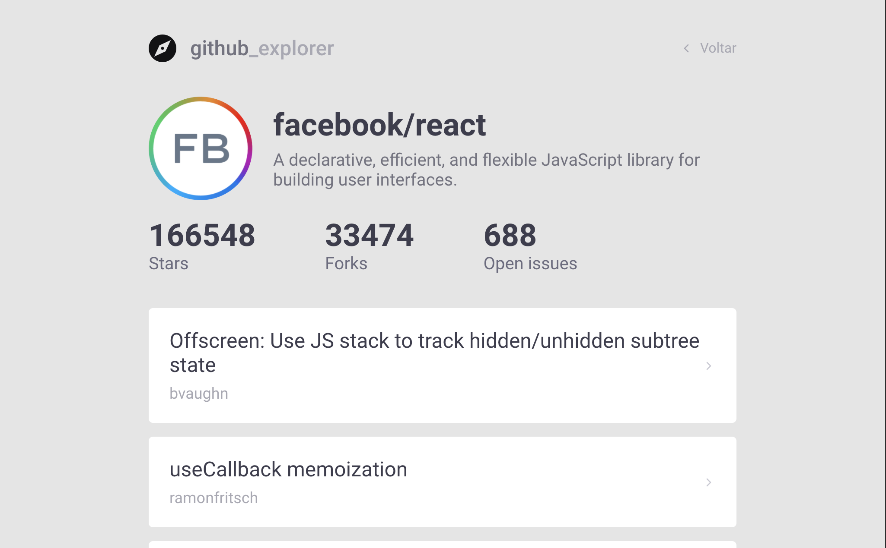

<h1 align="center">
     <a href="https://github-explorer.hewerton.dev" alt="site do GitHub Explorer"> GitHub Explorer </a>
</h1>

<h3 align="center">
    React application that alows look the details about GitHub repositories and list their issues. 💚
</h3>

<p align="center">
  

  

  <a href="https://github.com/hewerton/github-explorer/commits/master">
    
  </a>

   
   <a href="https://github.com/hewerton/github-explorer/stargazers">
    
  </a>

</p>

<h4 align="center">
	🚧   Finished 🚀 🚧
</h4>
<p align="center">
<a href="https://app.netlify.com/sites/hewerton-github-explorer/deploys">
    
  </a>
</p>


---

## 💻 About the project

GitHub Explorer - is a tool to list repositories and see your details as number of stars, forks and issues.

This project was made to use React features like hooks and states to manipulate the DOM. Also, was used mobile-first strategy to bild the UI with styled-components.


---

## ⚙️ Features

- [x] List repositories
  - Save the repositories data on local storage.
- [x] Show issues from repositories

---

## 🎨 Screenshots

This application has support for mobile devices.

### Mobile

<p align="center">
  
  
  
</p>

### Web

<p align="center" style="display: flex; align-items: flex-start; justify-content: center;">
  

  
</p>

---

## 🚀 How to run this project

1. Make a clone from this repository
2. Run ```yarn install```
3. Run ```yarn start```
4. It will automatically open in your browser


### Prerequisites

Before start, you will need install the folowing tools:
[Git](https://git-scm.com), [Node.js](https://nodejs.org/en/).
Also, you will need a good code editor. I recomend [VSCode] (https://code.visualstudio.com/).

---

## 🛠 Tech stack

The folowing tools was used to build this project:

#### **Website**  ([React](https://reactjs.org/)  +  [TypeScript](https://www.typescriptlang.org/))

-   **[React Router Dom](https://github.com/ReactTraining/react-router/tree/master/packages/react-router-dom)**
-   **[React Icons](https://react-icons.github.io/react-icons/)**
-   **[Axios](https://github.com/axios/axios)**
-   **[Polished](https://github.com/styled-components/polished)**
-   **[styled-components](https://github.com/styled-components/styled-components)**


> You can see a complete list of tools in  [package.json](https://github.com/hewerton/github-explorer/blob/master/package.json)

---

## 🦸 Autor

<a href="https://hewerton.dev">
 
 <br />
 <sub><b>Hewerton Oliveira</b></sub></a> <a href="https://hewerton.dev" title="Hewerton">🚀</a>
 <br />

[](https://www.linkedin.com/in/hewerton/)
[](mailto:hewerton.comp@gmail.com)

---

## 📝 License

This project is under the license MIT.

Made with ❤️ by Hewerton Oliveira 👋🏽 [Get in Touch!](https://www.linkedin.com/in/hewerton/)
